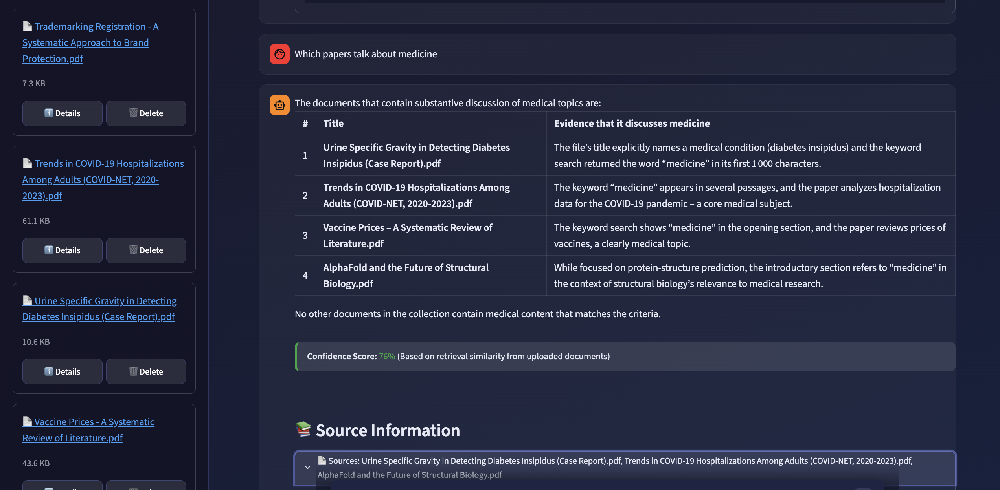

# 📚 Knowledge Base AI Agent — AWS-Native

Upload your documents (PDF, Word, or plain text), and this agent turns them into a searchable
knowledge base and answers questions about what's inside — always showing the passages it used and
how confident it is, so no answer is simply made up. Everything runs on AWS; a small local
Streamlit app is the chat window you talk to it through.

## ✨ Key Features

- 📄 **Upload PDF, Word, or plain text** — identical re-uploads are rejected automatically.
- 🔍 **Search by meaning and by keyword** — semantic search for paraphrased questions, keyword search for exact names and codes.
- 🤖 **Searches like a person would** — it decides how much digging a question needs and reads the full passage around whatever it finds.
- 📊 **Shows its work** — every answer carries the passages behind it and a confidence score with its breakdown.
- 🔐 **Locked behind an access token** — deployed and torn down with one command, and free while idle.

---

## 🧭 How It Works

**Ingestion.** A file is uploaded to the API, split into chunks, and stored in Postgres. The
original goes to S3 untouched. Every file is hashed by content, so an identical re-upload is
rejected as a duplicate.

**Query.** Agentic RAG. The agent has four tools — semantic search, keyword search, list documents,
and read document — and can reason across several rounds of them before it answers.

---

## 🏗️ Architecture

```
Local Streamlit ──HTTPS + x-api-key──▶ API Gateway (REST, API key + usage plan)
                                                  │
                                                  ▼
                                  Lambda — FastAPI via Mangum
                                  + LangGraph ReAct agent
                                  (Docker image, private isolated subnet)
                                       │         │          │
                         VPC endpoints │         │          │
                                       ▼         ▼          ▼
                                   Bedrock      S3     Secrets Manager
                                Titan + LLM  originals   DB password
                                       │
                                       ▼
                          RDS Postgres 16 + pgvector + pg_trgm
                          document / chunk tables, 1024-dim embeddings
```

**API Gateway** validates the API key and forwards the request to the **Lambda**, which runs the
FastAPI app through **Mangum** — the same app runs unchanged locally — and is billed per request,
costing nothing while idle. **RDS Postgres** is the knowledge base: `pgvector` supplies the vector
column type and similarity operators, so retrieval stays a SQL query instead of a second datastore
to keep in sync, and `pg_trgm` backs fuzzy matching. **S3** holds original files only, **Bedrock**
provides both models, and **Secrets Manager** holds the database password, read at cold start.

The Lambda sits in private isolated subnets with no route to the internet and reaches AWS services
through VPC endpoints, so traffic never crosses the public internet and no per-hour egress
infrastructure is needed. The database is the deliberate exception: it lives in a public subnet so
migrations can be run from a developer machine, with its security group restricted to the single
address in `DEV_ACCESS_IP`.

## 🧱 Design Decisions

Five decisions determine how far this design carries beyond a demo.

### Postgres as the retrieval layer

Document metadata, chunk text, and embeddings live in one database and are written in one
transaction. A vector index keeps the RAG search fast.

### Lambda as a container image

Container packaging raises the artifact limit from 250 MB unzipped to 10 GB — enough to fit
LangGraph, LangChain, SQLAlchemy, asyncpg, pypdf, python-docx, and boto3 together. Memory is
128 MB–10,240 MB either way and is unaffected by packaging. One Dockerfile produces both the
docker-compose container and the deployed artifact, so local and deployed behaviour come from the
same image.

### S3 for original files

Original files are stored untouched under `raw/{document_id}/` while their metadata stays in
Postgres. Every upload is hashed by content, so the same document is never stored twice.

### Alembic for schema changes

Each schema change is a versioned file: reviewable, reversible, and applied to every environment in
the same order. The data model changes without manual DDL, and queries go through the ORM with
bound parameters.

### One naming convention for every resource

Every name follows `<project>-<environment>-<resource>`, so the name itself says which project a
resource belongs to, which environment it runs in, and what it is. Where the namespace is global,
the account id is appended.

Because the environment is part of every name, dev, staging, and prod never collide.

---

## 📁 Project Structure

```
.
├── backend/              FastAPI service
│   ├── api/              HTTP routes
│   ├── domain/           upload pipeline, search
│   ├── models/           SQLAlchemy tables
│   ├── schemas/api/      Pydantic request/response
│   ├── services/agent/   LangGraph agent, tools
│   ├── infrastructure/   DB sessions (not the CDK app)
│   └── config/           settings
├── frontend/             Streamlit client
├── infrastructure/       CDK, one stack
│   └── backend/          network, database, storage, compute, api
├── alembic/              migrations
└── Makefile              deploys, migrations, dev servers
```

---

## 🚀 Getting Started

### Option A — Run it locally

```bash
docker-compose up -d pgvector    # Postgres + pgvector on :5432
make db-upgrade                  # create extensions, tables, index
make run                         # backend on :8000  (interactive docs at /docs)
make run-streamlit               # Streamlit client on :8501
```

### Option B — Deploy to AWS

```bash
make synth                       # render the CloudFormation template
make deploy-backend              # VPC, RDS, S3, Lambda, API Gateway
make destroy                     # tear it all down again
```

Migrations run automatically at Lambda cold start; to apply them ahead of a deploy, run
`make db-upgrade ENV=prod`.

## 📡 API Reference

| Method | Path | Purpose |
|---|---|---|
| GET | `/api/health/` | Liveness check |
| POST | `/api/upload/` · `/api/upload/batch` | Upload one or several files (`multipart/form-data`) |
| GET | `/api/files/` · `/api/files/{id}` | Document list (`skip`, `limit`) and metadata |
| GET | `/api/files/{id}/download` | Short-lived presigned S3 URL for the original |
| DELETE | `/api/files/{id}` | Delete a document and its chunks |
| POST | `/api/query/` | Ask the knowledge base a question |
| GET | `/api/query/count` | Total indexed chunk count |

Every route requires `x-api-key: <token>`, validated by API Gateway itself.

---

## 🧠 Inside the RAG Pipeline

**Sample documents.** `sample_docs/` holds eleven PDFs — ML papers, medical reports, marketing and
design texts

**Seeding.** Nothing is preloaded. The samples are uploaded through the API or the Streamlit client
like any other file, so ingestion is part of the solution rather than out of scope.

**Chunking.** Extracted text is split into 1000-character chunks with 200 characters of overlap,
each recording its offsets into the document. Every chunk is embedded with Titan v2 (1024
dimensions) into the `chunk` table; the full text stays on the document row, so any hit can be
expanded back into its surrounding passage.

**Retrieval.** The agent chooses, and may run several rounds:

| Tool | What it does |
|---|---|
| `semantic_search(concept)` | Cosine similarity over the embeddings — the 5 closest chunks, with their text |
| `keyword_search(pattern)` | Case-insensitive regex over the chunk text — locations only, no text |
| `list_documents()` | Filenames only, for questions about the corpus itself |
| `read_document(id, start, end)` | A character range of the extracted text, capped at 8000 characters |

**Prompt.** One system prompt — persona, task, tool descriptions, search strategy, output rules —
followed by the question and every tool result so far. Chunk text reaches the model in full.

**Grounding.** The prompt confines the answer to what the documents say and requires reading the
surrounding context before answering, since a chunk is cut at an arbitrary boundary. Where the
evidence is partial, the answer says where it stops.

**Scoring across tool calls.** Both signals accumulate per chunk, keyed by `chunk_id`, and a repeat
hit keeps the *higher* score instead of adding to it — searching the same passage twice never
inflates it. Semantic search contributes `1 − cosine_distance` per chunk. Keyword search scores per
call rather than per chunk: `1 − matched_documents / (total_documents + 1)`, so a pattern found in
few documents is rare and scores high, and every chunk that call matched carries that score. When
the agent stops, the two are fused over the union of their chunks — anything at or below 0.2 is
dropped as noise — treating them as independent evidence, so a chunk found both ways outranks one
found either way alone:

`combined = 1 − (1 − keyword) × (1 − semantic)`

---

## 🔐 Security

- **API boundary** — API key + usage plan on every route. Nothing is publicly callable.
- **Network** — the Lambda has no internet route and reaches AWS services through VPC endpoints
  only; the database is firewalled to a single IP.
- **Secrets** — the database password is generated by CDK into Secrets Manager and read at startup,
  never in source or an environment variable. `.env`, `.env.prod`, and `secrets.toml` are gitignored.
- **IAM** — the Lambda's role is scoped to `bedrock:InvokeModel` on exactly the two model ARNs it
  uses, read on one secret, and read/write on one bucket. No wildcard grants.
- **Data residency** — every model call goes to Bedrock inside your own account, and all content
  stays in your RDS instance. Nothing calls a non-AWS service.

---

## 💸 Cost Notes (sandbox account, $20 budget)

| Resource | Ongoing cost driver |
|---|---|
| Lambda, API Gateway, S3 gateway endpoint | Pay-per-use — $0 idle |
| RDS `db.t4g.micro`, 20GB | ~$12–13/month if left running |
| Bedrock (embeddings + LLM) | Pay-per-token, near-zero at demo volume |

---

## 📎 Evidence of Execution

**🎥 Walkthrough** — [watch the run on Google Drive](https://drive.google.com/file/d/1FrFbKnnKo2ikUdc9m6KNV4tDMdiqjEOS/view?usp=sharing)



---

## 🏭 Productionization

What I would change:

- **Private RDS** — move it into the isolated subnets so nothing reaches it from the internet, and
  run migrations from inside the VPC instead of whitelisting a developer IP.
- **Cognito login** — no shared API key; a per-user JWT validated by a Lambda authorizer, so every
  request carries an identity and documents can be scoped to their owner.
- **Presigned S3 upload** — the client PUTs straight to S3 instead of streaming through the API,
  lifting API Gateway's 10 MB payload cap and the Lambda timeout out of the upload path.
- **Scale RDS** — a larger instance plus RDS Proxy, since Lambda scales out faster than a
  `t4g.micro` accepts connections.
- **Add LangSmith** — traces of every agent run: which tools fired, what they returned, and where
  the latency and tokens went.
